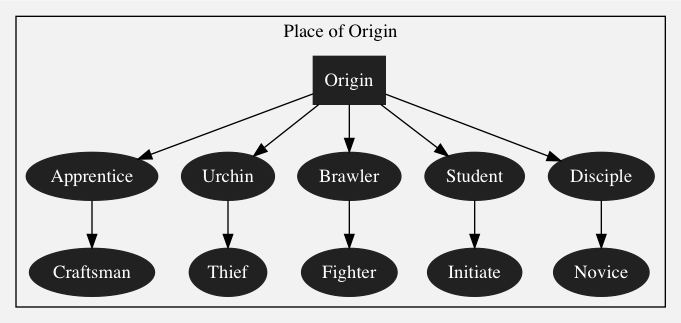
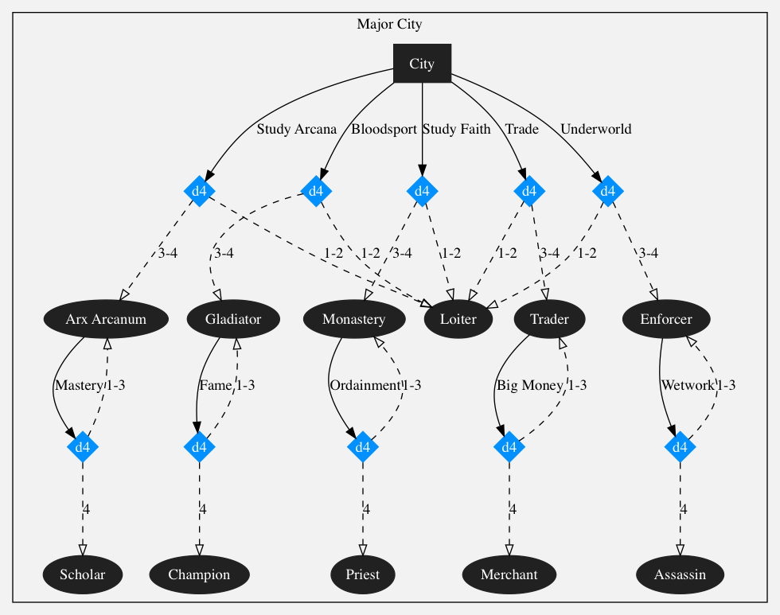
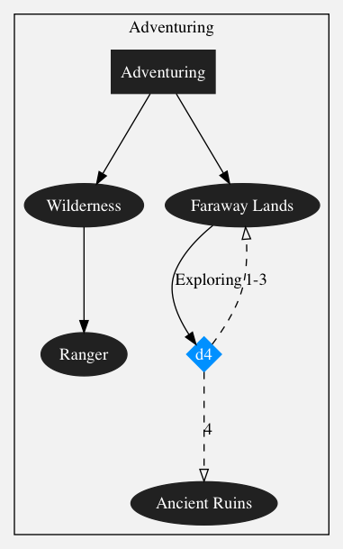
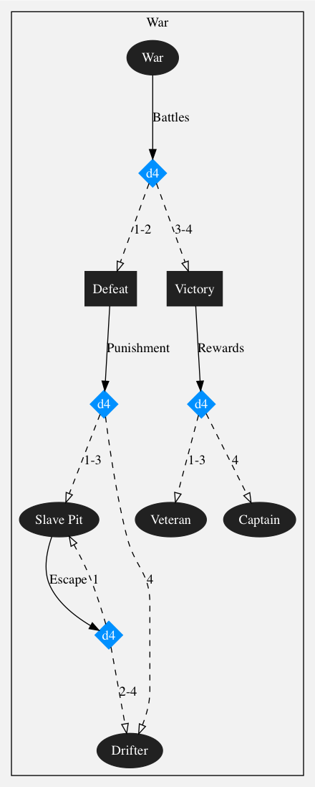

[&laquo; Table of Contents](..)

# Characters

## Player Character Races

### Men

Men are a diverse and populous race, who &mdash; despite their average racial traits &mdash; have reached a dominant position in many of the presently habitable lands.

#### Scythians

The Scythian people comprise multiple cultures from the coastal raiders of the north, the nomads of the eastern steppes to the desert tribes of the southern wastelands. Druidic and wild in nature, Scythians have heightened senses, and are somewhat lithe and tough.

#### Garrandines

The valleys and coasts are dotted by fiefdoms of a people priding in both their natural athleticism and learnedness. Through their more collectivist outlook, the Garrandines, as these people are known, have managed to rebuild much on the ruins of the old world.

### Elves

Elves are an Elder race that dominated much of the known world before Man’s ascendance. Proud and strong willed, elves have extremely keen senses and graceful dexterity. The elven race, like all the Elder races, is in terminal decline due to genetic damage caused by the Glow.

#### Gray Elves

The noble Gray elves embody the elven ideals of cool intellect, grace and presence of mind. Once the ruling class of glittering cities, the Gray elves now mainly cohabit human settlements, although some islands in the boundless Sea still hold their once-proud, spired castles.

#### Sylvan Elves

In the long years of elven ancestry, the Sylvan elves have become far estranged from their Gray elven kindred. Their isolationist society is brutally martial and values skill with the blade and the bow in combat above all else. The strongholds of these tribal elves are in the deep woods, but many of their kin are found in human lands as well.

### Dwarves

Dwarves are an Elder race as hard and unyielding as the bedrock in which they carve their fortresses. Standing slightly shorter than Men, dwarves are of a sturdy and muscular build and almost invariably wear large beards. The dwarven race, like all the Elder races, is in terminal decline due to genetic damage caused by the Glow.

#### Redbeards (Baraz-tarâg)

The Redbeard dwarf most immediately recognizable is the raucous, boisterous warrior armed to the teeth and clad in heavy armor. Redbeards revel in battle and carnage, but observe their own strict code of honor, making them a common sight in various mercenary companies. The Redbeards are no strangers to human lands, but prefer the fortresses of their Longbeard kin whenever practical.

#### Longbeards (Sigin-tarâg)

Longbeard dwarves share many of the traits of their red-bearded kin, but keep slightly cooler heads on their shoulders, well suited to the fine arts of cogitation and mercantilism. Despite this, these stout dwarves have not forgotten how to wield the axe and hammer. Their many mountainside fortresses, quarries, mines and forges dot the landscape far and wide.

### Gnomes

Gnomes are a curious and ancient Elder race, often mistaken as either young elves or dwarves due to their smaller stature. Their mischievous and humorous nature conceals exceptionally keen cognitive and empathic abilities. Surprisingly resilient and nimble, gnomes are the size of smallish, slender humans and sport a variety of facial hair styles. The gnomish race, like all the Elder races, is in terminal decline due to genetic damage caused by the Glow.

#### Tinkers

While not strictly a separate ethnic group, Tinker gnomes ascribe to a somewhat different philosophy than their Astromancer cousins. They have a mind of machinery and cogwheels, and embrace a more physically adventurous world view. Tinker gnomes are often found in dwarven smitheries and forges, but are well traveled.

#### Astromancers

Astromancer gnomes are those of their kin who have long taken a more spiritual interest in the world. Although they share the mechanical aptitude of their gnomish brethren, they are also fascinated by the deep currents of magic and the divine. These gnomes, rather uniquely, can be found among all of the other cultures &mdash; even the reclusive Sylvan elves &mdash; but also build their own settlements which mix the natural and the technological.

## Primary and Secondary Stats

### Primary Stats

Primary stats describe the fundamental nature of a character, governing the character's starting skills, skill development and derived stats.

| Stat | Key | Description | Mechanics |
|-|-|-|-|
| Physique | PHY | Athleticism, strength and speed. | Athletics, melee combat, weapons, armor |
| Dexterity | DEX | Gracefulness, balance, hand-eye-coordination, flexibility, fine-motor skills. | Acrobatics, ranged combat, stealth, sleight of hand |
| Constitution | CON | Health and robustness of body. | Endurance, critical wounds |
| Willpower | WIL | Presence of mind, focus, mental control. | Fortitude, arcane/divine ability |
| Cognition | COG | Comprehension, learning, memory, judgment. | Professional skills, magical/divine ability |
| Empathy | EMP | Ability to read, anticipate and manipulate persons based on social cues. | Social interaction, mercantile skills |
| Perception | PER | Awareness, sensory acuteness, attention to discrepancy. | Traps, ambushes, secrets, forgery, investigation |

### Secondary Stats

Secondary stats are derived from primary stats, but may also have external modifiers to their values.

| Stat | Derived as | Description |
|-|:-:|-|
| Critical | `CON` | Threshold for suffered damage to cause a critical wound to you. |
| Endurance | `⌊(CON - 7) / 2⌋ + 4` | Exhaustion limit from hardship and pain. The current Endurance is called Stamina. The missing Endurance is called Fatigue. Suffering Fatigue is also called suffering Pain. |
| Fortitude | `⌊(WIL - 7) / 2⌋ + 4` | Resistance to pain and shock from damage. |
| Wield | `⌊(PHY + CON) / 2⌋` | Soft limit on wieldable weapons and shields. For each point that the Wield limit is exceeded, a `-2` modifier is applied to the relevant combat skill. |
| Memory | `COG - 7` | Number of spells or prayers memorizable at once. |
| Sustain | `COG - 10` | Number of sustainable spell or prayer points. Minimum zero. |
| Awareness | `PER - 10` | Passive perception. |

## Character Creation

Character creation proceeds with the following steps.

1. Select your character's race. Record any racial traits on your [character sheet](game-props#character-sheet).
1. Select a name and gender for your character.
1. Perform the [life path](#life-path) process, assigning modifiers.
1. Record your [primary stats](#primary-stats). Derive and record your [secondary stats](#secondary-stats).
1. Record your base skill modifier values, derived from primary stats.
1. Assign XP points from the [group experience pool](quests-and-experience#group-experience).
1. [Calculate](quests-and-experience#assigning-xp) and record skill modifier values.
1. Acquire [abilities](#abilities) based on your XP distribution.
1. Purchase [starting equipment](#starting-equipment).
1. Bonus: Find a portrait image and print your [character card](game-props#character-card).
1. Bonus: Write a bio for your character based on the life path.

### Racial Stat Modifiers

The base value of every primary stat is `10`.

| Race               | PHY | DEX | CON | WIL | COG | EMP | PER |
|-|-:|-:|-:|-:|-:|-:|-:|
| **Men**            ||||||||
| Scythians          |     | `+1`| `+1`|     | `-1`| `-1`| `+2`|
| Garrandines        | `+1`|     |     | `+1`| `+1`| `+2`| `-1`|
| **Elves**          ||||||||
| Gray elves         | `-1`| `+1`| `-3`| `+3`| `+2`| `+1`| `+3`|
| Sylvan elves       | `+3`| `+3`| `-2`|     | `-2`|     | `+4`|
| **Dwarves**        ||||||||
| Redbeards          | `+3`| `-1`| `+4`| `-1`| `-2`| `-3`| `-2`|
| Longbeards         | `+2`| `-2`| `+4`| `+2`| `+3`| `-2`| `-3`|
| **Gnomes**         ||||||||
| Tinkers            | `-2`| `+3`| `+1`|     |     | `+2`| `+1`|
| Astromancers       | `-3`| `+1`|     | `+3`| `+4`| `+3`|     |

### Racial Skill Modifiers

Racial skill modifiers act as direct bonuses to skills.

#### Men

##### Scythians

- Druidism (`+1`)
- Throwing (`+1`)
- Sneaking (`+1`)

##### Garrandines

- Interaction (`+1`)
- Rite of Life (`+1`)
- Abjuration (`+1`)

#### Elves

##### Gray Elves

- Evocation (`+1`)
- Rite of Truth (`+1`)
- Athletics (`+1`)

##### Sylvan Elves

- Druidism (`+1`)
- Marksman (`+1`)
- Rite of Death (`+1`)

#### Dwarves

##### Redbeards

- Stabilization (`+1`)
- Two-handed (`+1`)
- Mercantile (`+1`)

##### Longbeards

- Mercantile (`+2`)
- Runecraft (`+1`)

#### Gnomes

##### Tinkers

- Traps/devices (`+1`)
- Field repair (`+1`)
- Athletics (`+1`)

##### Astromancers

- Traps/devices (`+1`)
- Conjuring (`+1`)
- Transcendence (`+1`)

### Life Path

The life path represents the formative years of character development, in abstract terms.

You begin at Place of Origin, and take *ten* rounds representing phases of character development. These phases may each be one year, or some other period of time.

There are four main locales or themes &mdash; Place of Origin, Major City, Adventuring and War. Place of Origin is your home village, neighborhood in a city, or similar place where your earliest development occurs. The City has the most opportunities, but here you will also face competition and may fail in pursuing objectives. Adventuring represents sojourns into the wilderness and faraway lands, and War the many local wars to which any character can either volunteer to or be swept to by Fate.

You can opt to leave to another major locale at each round, but once you leave Place of Origin, it cannot be returned to. At every change of major locale (except War), roll a `d4`. On a `1`, you end up in War instead.

The dark squares are the starting points of each major locale, except War which begins in the dark ellipse labeled War. The squares do not represent actual development, they only act as starting points toward the ellipses. From each node (square or ellipse), you may follow an outbound arrow to pursue that course. If the arrow leads to a blue diamond, you will need to roll a `d4`, and then follow the path whose label contains your roll result. These represent forking points in Fate where your character does not have control over their destiny.

Your choices in following the arrows may represent what your character desires, or you as the player may decide that Fate ordained some path for that characters.

During the life path, there are certain restrictions to bonuses gained.
- Primary stat values may change a maximum of `1` point
- Secondary stat values may change a maximum of `2` points
- Skills may gain a maximum of `+5 XP` bonus
- Bonuses to other life path `d4` checks have maximum `+1`

The [Half Round Up](quests-and-experience#half-round-up) rule is suspended during the life path process.

#### Place of Origin

##### Urchin

Life as a young street urchin. `+2 XP` Sneaking. Increases chance to become an *Enforcer* in City by `1`.

##### Thief

From a street urchin to nimble burglar in the night. `+1 XP` Lock picking, `+1 XP` Acrobatics. Increases chance to become *Assassin* in City by `1`.

##### Brawler

Playing fisticuffs for coin and a bit of wrestling. `+2 XP` Athletics. Increases chance to become *Gladiator* in City by `1`.

##### Fighter

Picking up the sword or axe comes easier with a big of fighting experience. `+1 XP` One-handed, `+1 XP` Two-handed. Increases chance to become *Champion* in City by `1`.

##### Student

Learning to read is beneficial for studies. Memory `+1`. Unlock an Arcane Aspect and gain `+1 XP` in it. Increases chance to be admitted to *Arx Arcanum* in City by `1`.

##### Initiate

First forays into the secret arts of the Arcana. Unlock an Arcane Aspect and gain `+2 XP` in it, or gain `+1 XP` in an already unlocked Aspect. Increases chance to become *Scholar* in City by `1`.

##### Disciple

Humility, learning the gods, and discipline. Memory `+1`. Unlock a Divine Rite and gain `+1 XP` in it. Increases chance to be admitted into *Monastery* in City by `1`.

##### Novice

Discovering the Divine Light and its ways. Unlock a Divine Rite and gain `+2 XP` in it, or gain `+1 XP` in an already unlocked Rite. Increases chance to become *Priest* in City by `1`.

##### Apprentice

Learning a trade is best done at a young age. `+2 XP` Field repair. Increases chance to become *Trader* in City by `1`.

##### Craftsman

Honing skills as a master craftsman. `+1 XP` Traps/devices, `+1 XP` Mercantile, `+1` [wealth](wealth#wealth-level). Increases chance to become *Merchant* in City by `1`.

#### Major City

##### Loiter

Not everything goes to plan always. Still, a moment to reflect may not be a bad thing. `+2 XP` to any skill in the skillset you have least experience in.

##### Arx Arcanum

Arx Arcanum, or *secret citadel*, is a place for studying the mysteries of the arcane arts. Sustain `+1`. Unlock an Arcane Aspect and gain `+2 XP` in it, or gain `+1 XP` in an already unlocked Aspect.

##### Scholar

Those who master the arcane arts are both feared and respected. `+1` COG. Unlock an Arcane Aspect and gain `+2 XP` in it, or gain `+1 XP` in an already unlocked Aspect.

##### Gladiator

Fighting in the Arena is dangerous but can be profitable and a valuable learning opportunity. `+2 XP` One-handed, `+2` [wealth](wealth#wealth-level).

##### Champion

Only those with determination and accomplished skill in combat, but also a flair for the dramatic become Champions. `+1` PHY, `+2 XP` Two-handed.

##### Trader

Those with a head for numbers and a good eye for value can turn a hefty profit in the City. `+2 XP` Mercantile, `+3` [wealth](wealth#wealth-level).

##### Merchant

To call oneself a Merchant implies one's connections reach far and wide. Exotic goods and coin aplenty find their way into your pockets. `+1` EMP, `+2 XP` Interaction.

##### Enforcer

The shady underworld is an opportunity for those with the skills and wit to navigate its perils. `+2 XP` Sleight of hand, `+1 XP` Throwing.

##### Assassin

The unseen blade in the night, the assassin is a dark instrument of the will of the underworld. `+1` DEX, `+2 XP` Forgery/disguise.

##### Monastery

An austere and forbidding place for the study of the divine, often located in inaccessible places. Sustain `+1`. Unlock a Divine Rite and gain `+2 XP` in it, or gain `+1 XP` in an already unlocked Rite.

##### Priest

Ordained in the Light of the Divine, a Priest commands fear in the hearts of sinners, and no one is without sin. `+1` WIL. Unlock a Divine Rite and gain `+2 XP` in it, or gain `+1 XP` in an already unlocked Rite.

#### Adventuring

##### Wilderness

The harsh wilderness has many lessons to those who survive its unforgiving tutelage. `+2 XP` Investigation/tracking.

##### Wastelands

The desolate places of the world that forces both natural and unnatural &mdash; those of the great war &mdash; have left all but lifeless. `+2 XP` Marksman, `+1 XP` Evasion.

##### Ranger

Those rugged individuals who have mastered the wastelands and have skill with bow and arrow are called Rangers. `+1` Awareness, `+1` Endurance. Increases chance to discover *Ancient Ruins* by `1`.

##### Faraway Lands

Many exotic lands await the intrepid adventurer with rich experiences and dangers. `+2 XP` Trauma treatment.

##### Ancient Ruins

Untold treasures of the ancient world are said to be found within the halls these relics. Roll on the Jackpot table.

#### War

##### War

War is a dirty dangerous business, but many things can be learned on the battlefield. Still, victory and defeat do not depend on one person. `+2 XP` Weapon-and-shield.

##### Drifter

Those who are lucky become drifters when a war is lost, wandering the lands looking for new purpose. `+2 XP` to any skill in the skillset you have least experience in.

##### Slave Pit

The unfortunate warrior on the losing side of a war may find themselves in a slave pit, toiling in terrible conditions under the whip of the victors. `+1` Fortitude, `+1 XP` Evasion.

##### Veteran

Those on the victor's side in a war mostly become Veterans, hardened by their experiences. `+2 XP` Stabilization, `+1` [wealth](wealth#wealth-level).

##### Captain

Some of those who are lucky enough to be on the winning side, and have distinguished themselves, find rank and prestige. Mastercrafted(16) weapon, `+2` [wealth](wealth#wealth-level).

### Starting Equipment

Each character starts with `2` [wealth](wealth#wealth-level) and whatever earned during life path.

Starting equipment purchases can be performed from the following table.

| Equipment | Cost |
|-|-:|
| Any [weapon](equipment#weapons) or [shield](equipment#shields) | 1 |
| Any [weapon](equipment#weapons) or [shield](equipment#shields), durability 15 | 2 |
| Light [armor](equipment#armor) (AV 1) | 1 |
| Medium [armor](equipment#armor) (AV 4) | 2 |
| Heavy [armor](equipment#armor) (AV 7) | 3 |

All starting items have durability `12`, unless otherwise specified.

## Skills

Most character actions are resolved through the application of skills.

Each skill is governed by a primary stat, whose value is here denoted `P`. The base value of a skill is derived as `P - 10` (can be negative). See [list of skills](#list-of-skills) for a list of which stats govern which skills.

### Skill Resolution

To resolve a skill check, roll a `d20` and add your skill modifier to obtain your roll value `R`. Then compare the roll value to a target difficulty `T`.

If `R > T`, the skill check is successful. Otherwise if `T - R < 5`, the skill check is a partial failure. Otherwise, the skill check is a failure.

The effect of success, partial failure and failure vary from skill to skill.

### Critical Success and Fumble

A natural (i.e. unmodified) `20` is a critical success, and counts as a success, even if the roll value is insufficient, unless otherwise specified.

A natural `1` is a fumble, and counts as a failure, even if the roll value is sufficient.

### Opposed Skill Resolution

Some skill checks are opposed, meaning that two characters directly oppose each other in their skill checks. In such cases, the character with higher roll value succeeds. If both characters roll a fumble or critical success, resolve as if neither had.

On a tie, the "resisting" character wins &mdash; for example, in a Sneaking check, the character who is passively observing.

### Advantage and Disadvantage

When you have *advantage*, you roll two `d20`'s for skill checks, and the natural roll value is the higher die result. With *disadvantage*, it's the lower result.

If a dice roll has advantage or disadvantage from multiple sources, it is the same as having single advantage or disadvantage.

If a dice roll has both advantage and disadvantage, it is resolved as if it had neither.

### Skill Target Difficulties

To make gameplay faster, skill check target difficulties are by default limited to a set of predefined target values with standardized names.

| Name | Target | Notes |
|-|-:|-|
| Normal | 10 | Default difficulty. Unskilled character has about 50% success rate.|
| Difficult | 20 | Highly skilled character has about 50% success rate.|
| Extreme | 25 | Natural `20` does not count as critical success.|

### Fatigue in Skill Checks

When a character is *fatigued*, each skill check is further modified by fatigue points. Roll value `R` is `d20` plus skill modifier `S` minus fatigue points `F`.

Combat skills, used during combat, are not subject to fatigue.

### List of Skills

Skills are divided into categories called skillsets. Some skills have associated keywords (e.g. *Melee.*) which can be used as a reference.

| Martial | Stat | Notes | Resolution |
|-|-|-|-|
| One-handed | PHY | *Melee.* Weapons wieldable by one hand. | See [skirmishing](combat#melee-skirmish-resolution), [wield limits](equipment#wield-limits). |
| Two-handed | PHY | *Melee.* Two-handed weapons. | See [skirmishing](combat#melee-skirmish-resolution), [wield limits](equipment#wield-limits). |
| Weapon-and-shield | PHY | *Melee.* Fighting with a shield.  | See [skirmishing](combat#melee-skirmish-resolution), [wield limits](equipment#wield-limits). |
| Marksman | DEX | *Ranged.* Bows, crossbows, guns etc. | See [ranged attacks](combat#ranged-attack-resolution), [ranged targeting](combat#ranged-targeting), [wield limits](equipment#wield-limits). |
| Throwing | DEX | *Ranged.* Knives, hatchets, javelins etc.  | See [ranged attacks](combat#ranged-attack-resolution), [ranged targeting](combat#ranged-targeting), [wield limits](equipment#wield-limits). |
| Evasion | DEX | Evading melee or ranged attacks passively. | See [combat](combat). |
| Athletics | PHY | *Physical.* Jumping, swimming/diving, feats of strength etc. | **Partial:** Failed, can retry. **Failure:** Failed, with possible injury. |

| Cloak-and-dagger | Stat | Notes | Resolution |
|-|-|-|-|
| Sneaking | DEX | *Stealth.* *Physical.* Move without being noticed. [Opposed](#opposed-skill-resolution): Awareness. See NPC [alertness](#npc-alertness). | **Partial:** Moved to destination, but cause [disturbance](#disturbance). **Failure:** Noticeable mid-movement. |
| Lock picking | DEX | *Stealth.* *Manual.* Silently pick locks on doors etc. | **Partial:** Lock unpicked, cause [disturbance](#disturbance), can retry. **Failure:** Lock jammed and unpickable, cause [disturbance](#disturbance).
| Sleight of hand | DEX | *Stealth.* *Manual.* Pick pockets, plant objects on persons, conceal weapons etc. [Opposed](#opposed-skill-resolution): Awareness. See NPC [alertness](#npc-alertness). | **Partial:** Failed but unnoticed. Can retry with [disadvantage](#advantage-and-disadvantage). **Failure:** Noticed mid-attempt. |
| Acrobatics | DEX | *Physical.* Scaling/climbing, tightrope walking, contortionism etc. | **Partial:** Stage fright, can retry. **Failure:** Fall, get stuck etc. |
| Traps/devices | DEX | *Mechanical.* Set or disarm traps and operate devices. | **Partial:** Failed, can retry. **Failure:** Failed, trap sprung/device malfunction. |
| Forgery/disguise | PER | Forge or identify a forged document or disguise a person. [Opposed](#opposed-skill-resolution): Forgery/disguise. | **Partial:** Technicality. **Failure:** Discovered as forged/believe authentic. |

| Arcane | Stat | Notes | Resolution |
|-|-|-|-|
| Evocation | WIL | *Sorcery.* See [Evocation](arcana-and-spellcasting#evocation). | See [spellcasting resolution](arcana-and-spellcasting#spellcasting-resolution). |
| Abjuration | WIL | *Sorcery.* See [Abjuration](arcana-and-spellcasting#abjuration). | See [spellcasting resolution](arcana-and-spellcasting#spellcasting-resolution). |
| Conjuring | WIL | *Sorcery.* See [Conjuring](arcana-and-spellcasting#conjuring). | See [spellcasting resolution](arcana-and-spellcasting#spellcasting-resolution). |
| Transcendence | WIL | *Sorcery.* See [Transcendence](arcana-and-spellcasting#transcendence). | See [spellcasting resolution](arcana-and-spellcasting#spellcasting-resolution). |
| Druidism | WIL | See [Druidism](arcana-and-spellcasting#druidism). | See [spellcasting resolution](arcana-and-spellcasting#spellcasting-resolution). |
| Runecraft | WIL | See [Runecraft](arcana-and-spellcasting#runecraft). | See [spellcasting resolution](arcana-and-spellcasting#spellcasting-resolution). |
| Artifice | WIL | See [Artifice](arcana-and-spellcasting#artifice). | See [spellcasting resolution](arcana-and-spellcasting#spellcasting-resolution). |

| Divine | Stat | Notes | Resolution |
|-|-|-|-|
| Rite of Life | WIL | See [Rite of Life](divinity-and-prayer#rite-of-life). | See [Divine prayer](divinity-and-prayer#divine-prayer). |
| Rite of Death | WIL | See [Rite of Death](divinity-and-prayer#rite-of-death). | See [Divine prayer](divinity-and-prayer#divine-prayer). |
| Rite of Truth | WIL | See [Rite of Truth](divinity-and-prayer#rite-of-truth). | See [Divine prayer](divinity-and-prayer#divine-prayer). |

| Utility | Stat | Notes | Resolution |
|-|-|-|-|
| Stabilization | COG | *Medical.* Stop bleeding. | **Partial:** Failed, can retry next [watch](time-and-space#watches). **Failure:** Failed, patient cannot be stabilized by *Medical* checks. |
| Trauma treatment | COG | *Medical.* Treat a critical wound. | **Partial:** Untreated, can retry at next opportunity. **Failure:** Untreated, cause 1 pain, can retry at next opportunity. |
| Investigation/tracking | PER | Actively search a scene for clues, or follow tracks. | **Partial:** Gain vague idea, can retry next [watch](time-and-space#watches). **Failure:** No clues, scene contaminated and cannot be investigated. Tracks trampled. |
| Interaction | EMP | *Social.* Inquiry, persuasion, interrogation, deception. | **Partial:** Failed, can retry at next opportunity. **Failure:** Inquiry, persuasion, deception: [disposition](#npc-disposition) lowered. Interrogation: subject dead. |
| Mercantile | EMP | *Social.* Purchases of items. | **Partial:** Failed, can retry at next opportunity. **Failure:** Failed, lose `1` [wealth level](wealth#wealth-level). Can retry at next opportunity. |
| Field repair | PER | *Mechanical.* Restore equipment in disrepair. | **Partial:** Failed, can retry at next opportunity. **Failure:** Failed, can retry at next opportunity. |

## Abilities

*Abilities* are special skills that characters can unlock. An ability becomes available when the total amount of XP spent in that ability's skillset meets the required level and possible prerequisites.

Only one ability may be unlocked per required XP level, so if multiple abilities in the same skillset have the same required level, you must choose which one to acquire.

### List of Abilities

[//]: # (2,3,5,8,13,21,34)

| Martial | XP | Description |
|-|-:|-|
| Taunt | | **Assignment:** Assign two opponents to yourself in a skirmish. |
| Duelist | | Gain `+1` skill modifier when in melee with a single opponent. |
| Skirmisher | | Gain `+2` skill modifier when in melee with multiple opponents. |
| Shield Rush | | **Move:** When using a shield, push through opponents' [zone of control](time-and-space#zone-of-control). |
| Precise Shot | | **Ranged:** When attacking with a ranged weapon against a target who is unaware of you, gain [advantage](#advantage-and-disadvantage). |
| Double Shot | | **Ranged:** Attack a target with a ranged weapon twice in a round. During the next round, you cannot do ranged attacks and have [disadvantage](#advantage-and-disadvantage) to Evasion. |
| Heavy Blow | | **Melee:** Gain `-2` skill modifier, but if you win, two opponents (by lowest natural roll) take damage. |

| Cloak-and-dagger | XP | Description |
|-|-:|-|
| Back to Back | | **Assignment:** Join a friendly character's skirmish. |
| Backstab | | |
| Quickdraw | | If you succeed in a Sleight of hand ([Opposed](#opposed-skill-resolution): Awareness) check, [ambush](environment#ambushes) one non-hostile character even if they are aware of you. |
| Bird Call | | If you succeed in a Sleight of hand ([Opposed](#opposed-skill-resolution): Awareness) check, lower the [alertness](#npc-alertness) of nearby NPCs from *Suspicious* to *On duty*. |
| Sixth Sense | | When you are ambushed, instead of having [disadvantage](#advantage-and-disadvantage) to combat rolls on the first round, you have [advantage](#advantage-and-disadvantage).

| Arcane | XP | Description |
|-|-:|-|
| TODO | TODO | TODO |

| Divine | XP | Description |
|-|-:|-|
| TODO | TODO | TODO |

| Utility | XP | Description |
|-|-:|-|
| TODO | TODO | TODO |
| Eagle Eye | | Awareness `+2`. |

## Non-Player Characters

Non-player characters, or NPCs, are characters controlled by the Game Master.

### NPC Disposition

NPC *disposition* indicates how friendly a that character is toward the player characters.

| Disposition | Notes |
|-|-|
| Friendly | *Social* skill checks have [advantage](#advantage-and-disadvantage). |
| Neutral | Default disposition. |
| Unfriendly | *Social* skill checks have [disadvantage](#advantage-and-disadvantage). |
| Hostile | NPC may attack. *Social* skill checks have [disadvantage](#advantage-and-disadvantage). NPC will not do trading. |

### NPC Alertness

For purposes of stealth, NPCs have an *alertness* state, that affects how they react to *disturbances*.

| Alertness | Notes |
|-|-|
| Relaxed | NPC is not paying attention, and is not patrolling. Stealth rolls have [advantage](#advantage-and-disadvantage). |
| Distracted | NPC's attention is elsewhere, and NPC is not patrolling. Stealth rolls have [advantage](#advantage-and-disadvantage). |
| On duty | Default alertness. NPC may be patrolling [areas](time-and-space#local-areas).
| Suspicious | NPC may investigate. Stealth rolls have [disadvantage](#advantage-and-disadvantage). NPC cannot be ambushed. |
| Alerted | NPC raises [alarm](#alarms) and prepares for combat. Stealth rolls have [disadvantage](#advantage-and-disadvantage). NPC cannot be ambushed. |

NPCs are generally aware of characters in their [areas](time-and-space#local-areas) and adjacent areas, if those characters are not using stealth.

#### Disturbance

A disturbance is a noise or other cue which causes any nearby NPC to increase its alertness level by one step. NPC alertness is generally reset in the next [watch](time-and-space#watches).

#### Alarms

When an NPC raises an alarm, other NPCs in the adjacent [areas](time-and-space#local-areas) or designated guard posts will respond.

[&laquo; Table of Contents](..)

[&raquo; Combat](combat)
